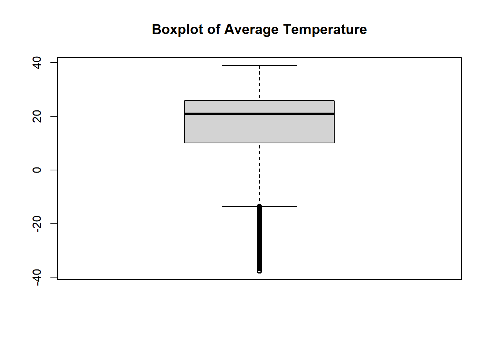
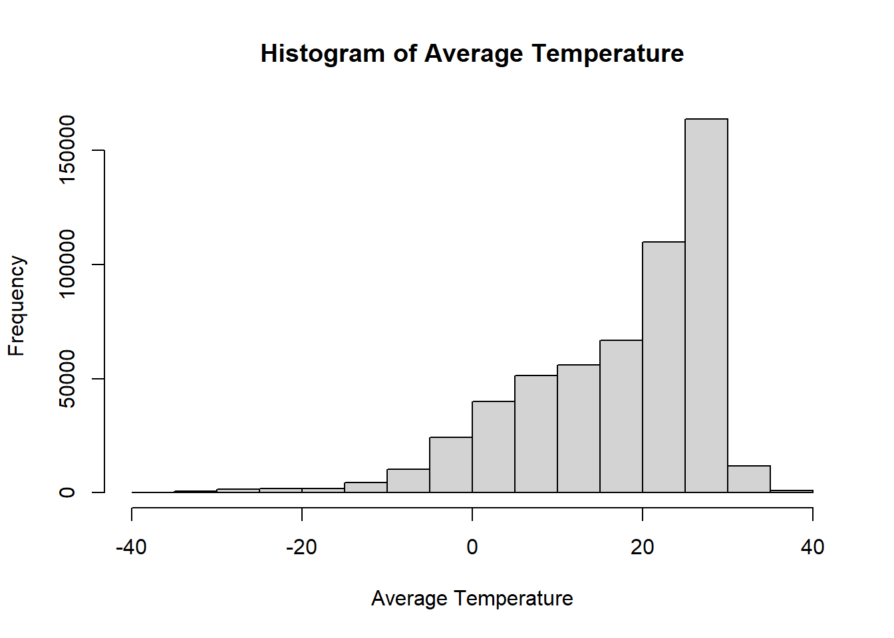
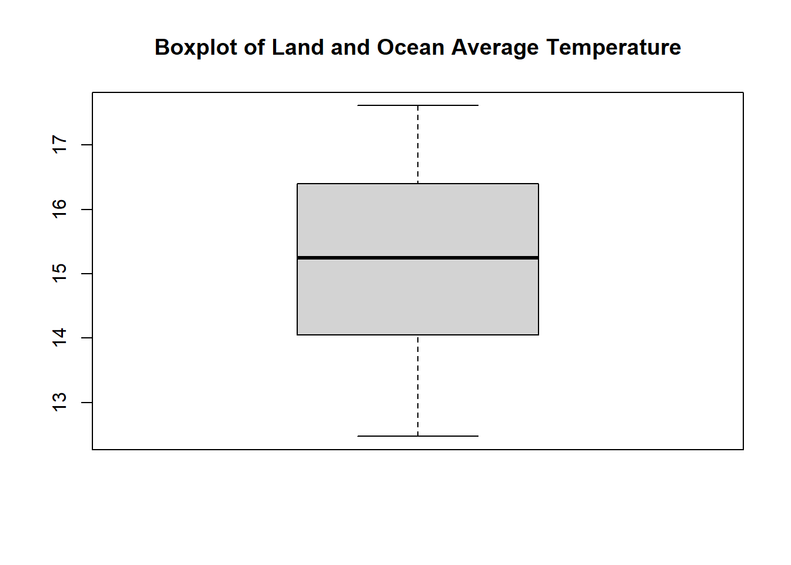
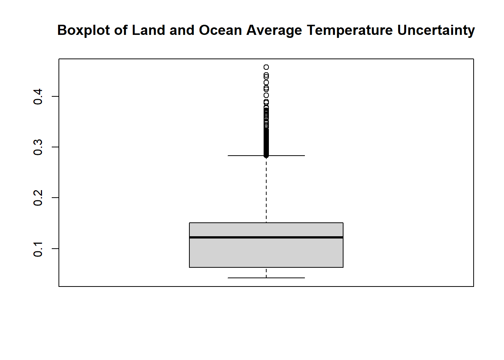

# Visualitzacio de Dades PR1 - Processat

#### Àlex Bedmar Martínez

#### 29/11/2023

## Climate Change: Earth Surface Temperature Data

El conjunt de dades sobre el canvi climàtic ofereix una visió global de les tendències de la temperatura des de 1750, permetent l’exploració a diversos nivells. Amb més de 1.600 milions de registres, combina dades quantitatives i categòriques, proporcionant una perspectiva completa de les temperatures globals i locals.

En aquest document farem una inspecció de les dades per detectar possibles necessitats més endavant.

    setwd('/Users/alexb/OneDrive/Escritorio/UOC/(VD) Visualització de dades/PR1/')

    df1 <- read.csv(file = "GlobalLandTemperaturesByCountry.csv", header = T)
    head(df1)

    ##           dt AverageTemperature AverageTemperatureUncertainty Country
    ## 1 1743-11-01              4.384                         2.294  Ã…land
    ## 2 1743-12-01                 NA                            NA  Ã…land
    ## 3 1744-01-01                 NA                            NA  Ã…land
    ## 4 1744-02-01                 NA                            NA  Ã…land
    ## 5 1744-03-01                 NA                            NA  Ã…land
    ## 6 1744-04-01              1.530                         4.680  Ã…land

    df2 <- read.csv(file = "GlobalTemperatures.csv", header = T)
    head(df2)

    ##           dt LandAverageTemperature LandAverageTemperatureUncertainty
    ## 1 1750-01-01                  3.034                             3.574
    ## 2 1750-02-01                  3.083                             3.702
    ## 3 1750-03-01                  5.626                             3.076
    ## 4 1750-04-01                  8.490                             2.451
    ## 5 1750-05-01                 11.573                             2.072
    ## 6 1750-06-01                 12.937                             1.724
    ##   LandMaxTemperature LandMaxTemperatureUncertainty LandMinTemperature
    ## 1                 NA                            NA                 NA
    ## 2                 NA                            NA                 NA
    ## 3                 NA                            NA                 NA
    ## 4                 NA                            NA                 NA
    ## 5                 NA                            NA                 NA
    ## 6                 NA                            NA                 NA
    ##   LandMinTemperatureUncertainty LandAndOceanAverageTemperature
    ## 1                            NA                             NA
    ## 2                            NA                             NA
    ## 3                            NA                             NA
    ## 4                            NA                             NA
    ## 5                            NA                             NA
    ## 6                            NA                             NA
    ##   LandAndOceanAverageTemperatureUncertainty
    ## 1                                        NA
    ## 2                                        NA
    ## 3                                        NA
    ## 4                                        NA
    ## 5                                        NA
    ## 6                                        NA

## Tractar els valors perduts

Suprimir les columnes amb valors que falten excessius:

    cat("Dimensions of 'By country' df before filtering:", dim(df1), "\n")

    ## Dimensions of 'By country' df before filtering: 577462 4

    df1 <- df1[complete.cases(df1), ]
    cat("Dimensions of 'By country' df after filtering:", dim(df1), "\n")

    ## Dimensions of 'By country' df after filtering: 544811 4

    cat("Dimensions of 'Global temperatures' df before filtering:", dim(df2), "\n")

    ## Dimensions of 'Global temperatures' df before filtering: 3192 9

    df2 <- df2[complete.cases(df2), ]
    cat("Dimensions of 'Global temperatures' df after filtering:", dim(df2), "\n")

    ## Dimensions of 'Global temperatures' df after filtering: 1992 9

## Homogeneïtzar dades categòriques

Netejar i homogeneïtzar les dades categòriques

    df1$Country <- tolower(df1$Country)

## Detectar valors extrems en dades numèriques

Generar box plots i hisotgràmes per detectar outliers.

|:-------------------------:|:-------------------------:|
|  |  |
|  |  |

  

  

  

  

## Extracció de característiques

Extreure l’any i el mes de la columna “dt”.

    df1$Year <- format(as.Date(df1$dt), "%Y")
    df1$Month <- format(as.Date(df1$dt), "%m")

    df2$Year <- format(as.Date(df2$dt), "%Y")
    df2$Month <- format(as.Date(df2$dt), "%m")

    cat("Minimum Year of 'By country' df:", min(df1$Year), "\n")

    ## Minimum Year of 'By country' df: 1743

    cat("Maximum Year of 'By country' df:", max(df1$Year), "\n")

    ## Maximum Year of 'By country' df: 2013

    cat("Minimum Year of 'Global temperatures' df:", min(df2$Year), "\n")

    ## Minimum Year of 'Global temperatures' df: 1850

    cat("Maximum Year of 'Global temperatures' df:", max(df2$Year), "\n")

    ## Maximum Year of 'Global temperatures' df: 2015

## Combinar-ho amb altres conjunts de dades

Combinar les dades dels diferents dataframes

    merged_df <- merge(df1, df2, by="dt", all=TRUE)
    head(merged_df)

    ##           dt AverageTemperature AverageTemperatureUncertainty
    ## 1 1743-11-01              4.384                         2.294
    ## 2 1743-11-01             10.692                         1.857
    ## 3 1743-11-01              3.697                         2.214
    ## 4 1743-11-01              5.668                         2.221
    ## 5 1743-11-01              8.620                         2.268
    ## 6 1743-11-01              6.391                         2.391
    ##                  Country Year.x Month.x LandAverageTemperature
    ## 1                 ã…land   1743      11                     NA
    ## 2               guernsey   1743      11                     NA
    ## 3               slovakia   1743      11                     NA
    ## 4               slovenia   1743      11                     NA
    ## 5                albania   1743      11                     NA
    ## 6 bosnia and herzegovina   1743      11                     NA
    ##   LandAverageTemperatureUncertainty LandMaxTemperature
    ## 1                                NA                 NA
    ## 2                                NA                 NA
    ## 3                                NA                 NA
    ## 4                                NA                 NA
    ## 5                                NA                 NA
    ## 6                                NA                 NA
    ##   LandMaxTemperatureUncertainty LandMinTemperature
    ## 1                            NA                 NA
    ## 2                            NA                 NA
    ## 3                            NA                 NA
    ## 4                            NA                 NA
    ## 5                            NA                 NA
    ## 6                            NA                 NA
    ##   LandMinTemperatureUncertainty LandAndOceanAverageTemperature
    ## 1                            NA                             NA
    ## 2                            NA                             NA
    ## 3                            NA                             NA
    ## 4                            NA                             NA
    ## 5                            NA                             NA
    ## 6                            NA                             NA
    ##   LandAndOceanAverageTemperatureUncertainty Year.y Month.y
    ## 1                                        NA   <NA>    <NA>
    ## 2                                        NA   <NA>    <NA>
    ## 3                                        NA   <NA>    <NA>
    ## 4                                        NA   <NA>    <NA>
    ## 5                                        NA   <NA>    <NA>
    ## 6                                        NA   <NA>    <NA>

    dim(merged_df)

    ## [1] 544838     16

#### Pre-processar la resta de les dades

Per processar i netejar les dades dels dataframes restants (By state, by major city, by city) podríem seguir un process com el que s’ha dut a terme aquí.

